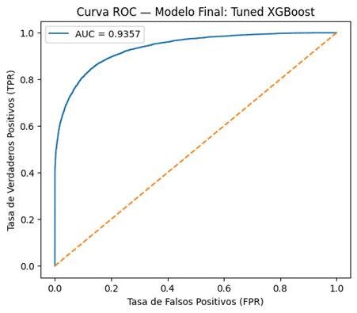
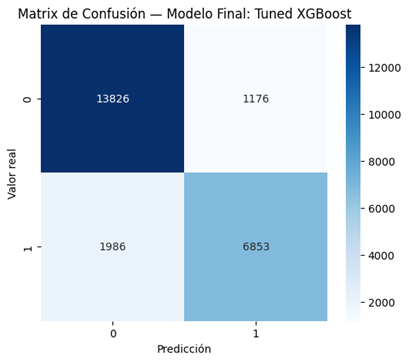
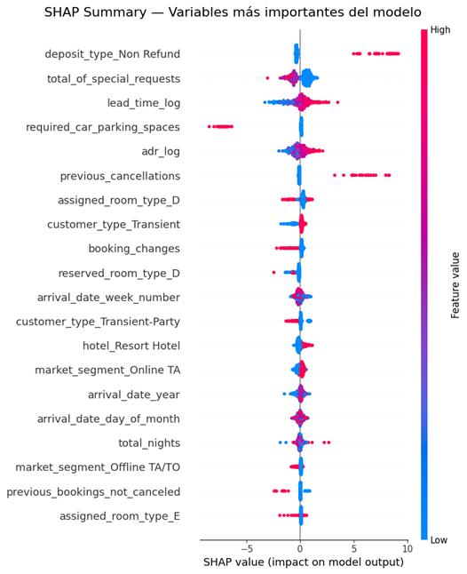
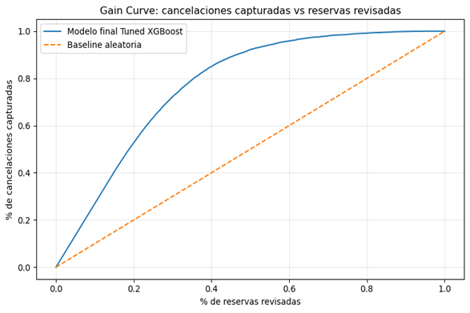

\newpage
# Resumen Ejecutivo

El presente proyecto tuvo como objetivo desarrollar un sistema predictivo para identificar reservas hoteleras con alta probabilidad de cancelación antes del check-in, con el fin de apoyar la toma de decisiones operativas y reducir pérdidas económicas asociadas a cancelaciones no anticipadas.

Las cancelaciones representan un desafío importante para la industria hotelera, ya que afectan ingresos, ocupación efectiva y estrategias de revenue management, generando habitaciones vacías, ineficiencia operativa y dificultades en la planificación comercial.

Para abordar este problema, se analizaron datos históricos de reservas hoteleras y se evaluaron distintos modelos predictivos. Luego de comparar múltiples alternativas y realizar procesos de optimización y validación, se seleccionó un modelo final debido a su adecuado equilibrio entre capacidad predictiva, estabilidad, interpretabilidad y utilidad para el negocio.

El análisis identificó que factores como la anticipación de la reserva, el tipo de depósito, la tarifa promedio, el historial de cancelaciones previas y el segmento de mercado tienen una fuerte relación con el riesgo de cancelación.

El modelo final alcanzó resultados sólidos, logrando identificar aproximadamente el 77.5% de las reservas que realmente terminarán cancelándose, manteniendo además una alta capacidad para diferenciar reservas de riesgo alto y bajo.

Asimismo, el modelo demostró capacidad para concentrar gran parte de las cancelaciones reales dentro de los segmentos clasificados como de mayor riesgo, permitiendo priorizar acciones preventivas sobre un subconjunto reducido de reservas y optimizar recursos operativos.

Desde la perspectiva de negocio, el análisis económico mostró que no detectar una cancelación real puede generar pérdidas considerablemente mayores que realizar una intervención preventiva innecesaria. Por esta razón, el proyecto priorizó maximizar la detección temprana de cancelaciones potenciales.

Asimismo, se identificó un umbral operativo óptimo que permite aumentar significativamente la detección de reservas riesgosas y mejorar el impacto económico esperado del sistema.

Bajo el escenario evaluado, la implementación del modelo podría generar ahorros netos anuales estimados entre 310 mil y 431 mil unidades monetarias mediante acciones preventivas como reconfirmaciones, campañas de retención, solicitudes de depósito y estrategias de overbooking controlado.

Finalmente, se recomienda implementar inicialmente un MVP supervisado en segmentos de mayor riesgo, acompañado de monitoreo continuo, evaluación periódica del desempeño y actualizaciones progresivas del modelo conforme evolucionen los patrones de comportamiento de los clientes.
 
\newpage

# Contexto del Negocio 

## Descripción del problema
La industria hotelera enfrenta constantemente pérdidas operativas asociadas a cancelaciones de reservas realizadas antes de la fecha de check-in. Estas cancelaciones afectan directamente la capacidad del hotel para planificar adecuadamente su ocupación y maximizar ingresos, especialmente cuando ocurren de manera tardía o sin posibilidad de reemplazar la reserva cancelada.

Las cancelaciones generan múltiples impactos negativos sobre la operación hotelera, entre ellos:

- baja ocupación efectiva
- ingresos no percibidos
- habitaciones vacías
- problemas de planificación logística
- ineficiencia en asignación de habitaciones
- dificultades en estrategias de overbooking
- menor eficiencia en revenue management

Además, la alta variabilidad en el comportamiento de los clientes dificulta anticipar qué reservas tienen mayor probabilidad de cancelarse, lo que limita la capacidad del hotel para aplicar acciones preventivas de manera eficiente.

##	Objetivo de negocio
El objetivo principal del proyecto es desarrollar un modelo predictivo capaz de identificar reservas con alta probabilidad de cancelación antes del check-in, permitiendo al hotel tomar decisiones preventivas y optimizar estrategias operativas y comerciales.

La finalidad no es únicamente generar predicciones, sino convertir dichas predicciones en acciones concretas que reduzcan pérdidas económicas y mejoren la gestión de ocupación.

Entre las posibles acciones preventivas se incluyen:

- confirmaciones anticipadas
- campañas de retención
- solicitudes de depósito
- reconfirmaciones automáticas
- estrategias de overbooking controlado
- priorización operativa de reservas riesgosas

## Variable objetivo
La variable objetivo utilizada en el proyecto fue: **is_canceled**

| Valor | Interpretación |
|---|---|
| 1 | Reserva cancelada |
| 0 | Reserva no cancelada |

El problema se formuló como una tarea de clasificación binaria supervisada, donde el modelo debe aprender patrones asociados a reservas que finalmente son canceladas.

## Stakeholders principales

El proyecto involucra distintas áreas estratégicas del negocio hotelero, ya que las cancelaciones impactan tanto la operación diaria como la rentabilidad financiera.

- **Revenue Management:** Responsable de optimizar ocupación, precios y estrategias de sobreventa.

- **Operaciones hoteleras:** Encargada de la planificación operativa y asignación eficiente de habitaciones.

- **Área comercial:** Interesada en estrategias de retención y relación con clientes.

- **Gerencia financiera:** Responsable de evaluar impacto económico, pérdidas evitadas y retorno potencial del proyecto.

## KPI de negocio

Los principales indicadores de éxito definidos para el proyecto fueron:

| KPI | Objetivo |
|---|---|
| Reducción de cancelaciones no anticipadas | Detectar reservas de alto riesgo |
| Incremento de ocupación efectiva | Reducir habitaciones vacías |
| Reducción de pérdidas económicas | Minimizar revenue perdido |
| Mejora del ingreso promedio | Optimizar revenue management |
| Mayor eficiencia operativa | Priorizar intervenciones sobre reservas riesgosas |

## Criterios de éxito del proyecto

Desde la perspectiva de negocio, el proyecto definió como criterios principales de éxito:

- alcanzar un recall elevado para detectar la mayor cantidad posible de cancelaciones reales
- superar el desempeño de reglas manuales o modelos baseline
- generar alertas accionables para el equipo operativo
- demostrar potencial de impacto económico positivo

Debido a que el costo de no detectar una cancelación real es considerablemente mayor que el costo operativo de una falsa alerta, el proyecto priorizó el Recall como métrica principal de evaluación.

# Datos y Preparación

## Fuente de datos

El proyecto utilizó un dataset histórico de reservas hoteleras que contiene información operativa, financiera y de comportamiento asociada a clientes y reservas. El conjunto de datos incluye registros de reservas canceladas y no canceladas, permitiendo construir un modelo supervisado de clasificación binaria.

Cada observación representa una reserva individual e incluye variables relacionadas con:

- características del cliente
- comportamiento de reserva
- información comercial
- variables operativas del hotel

El dataset permitió analizar patrones históricos asociados a cancelaciones y evaluar el impacto de distintas variables sobre el riesgo de cancelación.

## Variables utilizadas

Para el desarrollo del modelo se utilizaron variables de distintos tipos, agrupadas según su función dentro del negocio hotelero.

- **Variables demográficas y operativas**

Estas variables describen características generales del cliente y del canal de reserva.

| Variable | Descripción |
|---|---|
| País | País de origen del cliente |
| Segmento de mercado | Tipo de segmento comercial asociado a la reserva |
| Canal de distribución | Medio por el cual se realizó la reserva |
| Tipo de cliente | Clasificación del cliente según comportamiento o perfil |

Estas variables ayudan a identificar diferencias de comportamiento entre distintos grupos de clientes y segmentos comerciales.

- **Variables financieras**

Las variables financieras permiten estimar el impacto económico potencial asociado a una reserva.

| Variable | Descripción |
|---|---|
| ADR (Average Daily Rate) | Tarifa diaria promedio de la reserva |
| Tipo de depósito | Política de garantía o depósito asociada a la reserva |

Estas variables son especialmente relevantes porque el análisis económico del proyecto utiliza el ADR como aproximación del revenue potencial en riesgo por cancelaciones.

- **Variables de comportamiento**

Las variables de comportamiento describen patrones históricos y características de la reserva que suelen estar asociadas al riesgo de cancelación.

| Variable | Descripción |
|---|---|
| Lead Time | Número de días entre la reserva y el check-in |
| Cancelaciones previas | Historial de cancelaciones del cliente |
| Solicitudes especiales | Requerimientos adicionales realizados por el cliente |

Estas variables mostraron alta importancia dentro del modelo final y fueron determinantes para la predicción de cancelaciones.

## Análisis exploratorio de datos (EDA)

Durante el análisis exploratorio se evaluó:

- distribución de la variable objetivo
- presencia de valores faltantes
- comportamiento de variables numéricas
- distribución de variables categóricas
- correlaciones entre variables
- patrones de cancelación según segmentos

El análisis identificó que el dataset presentaba desbalance de clases, debido a que las reservas no canceladas son más frecuentes que las canceladas.

También se observaron diferencias importantes en tasas de cancelación según:

- tipo de depósito
- lead time
- segmento de mercado
- historial previo de cancelaciones

Estos hallazgos ayudaron a orientar tanto el preprocesamiento como la selección de variables relevantes para el modelado.

## Preprocesamiento realizado

Con el objetivo de garantizar calidad y consistencia en los datos utilizados para entrenamiento, se aplicaron distintas etapas de limpieza y transformación.

- **Limpieza de datos**

Se realizaron procedimientos de depuración para reducir ruido e inconsistencias en el dataset. Las principales acciones incluyeron:

- eliminación de registros duplicados
- tratamiento de valores faltantes
- corrección de inconsistencias
- revisión de formatos y tipos de datos
- eliminación de variables con riesgo de data leakage

Asimismo, se excluyeron variables que contenían información no disponible al momento de la predicción o que podían introducir fuga de información hacia la variable objetivo, evitando sobreestimación artificial del desempeño del modelo.

- ** Transformaciones y feature engineering**

Debido a que el dataset contenía variables categóricas y numéricas, se aplicaron transformaciones para hacer compatibles los datos con los algoritmos de Machine Learning.

Entre las principales transformaciones realizadas se encuentran:

- encoding de variables categóricas
- escalamiento de variables numéricas
- normalización de formatos
- generación de nuevas variables derivadas (feature engineering)

El proceso de feature engineering permitió capturar relaciones adicionales relevantes para el problema de negocio.

Entre las principales variables derivadas se incluyeron:

- **total_nights:** duración total de la estadía
- **total_guests:** tamaño total del grupo de huéspedes
- **is_high_season:** indicador de temporada alta

Adicionalmente, se aplicaron transformaciones logarítmicas sobre variables como `adr` y `lead_time` para reducir asimetría y mitigar el impacto de valores extremos.

Posteriormente, se realizó un nuevo análisis de correlación para evaluar posibles problemas de multicolinealidad. Los resultados mostraron correlaciones moderadas entre variables, sin evidencia de relaciones lineales fuertes (> 0.8), indicando una reducción adecuada de redundancia en el dataset.

Asimismo, se aplicó One-Hot Encoding sobre las variables categóricas para transformarlas a formato numérico compatible con los modelos. Para evitar multicolinealidad, se utilizó la configuración `drop_first=True`, eliminando una categoría base en cada variable categórica.

- **Balanceo de clases**

El dataset presentaba un desbalance moderado entre reservas canceladas y no canceladas, con una mayor proporción de reservas no canceladas.

Para abordar este problema y mejorar la capacidad del modelo de detectar cancelaciones reales, se aplicó la técnica SMOTE (*Synthetic Minority Over-sampling Technique*), la cual genera observaciones sintéticas de la clase minoritaria.

Inicialmente, la distribución de clases era aproximadamente:

- 63% reservas no canceladas
- 37% reservas canceladas

Luego de aplicar SMOTE sobre el conjunto de entrenamiento, ambas clases quedaron balanceadas en proporción 50% – 50%, permitiendo que el modelo aprendiera de manera más efectiva los patrones asociados a cancelaciones.

Es importante destacar que el balanceo fue aplicado únicamente sobre el conjunto de entrenamiento, manteniendo el conjunto de prueba sin modificaciones para evitar data leakage y garantizar una evaluación realista del desempeño del modelo.

Asimismo, se eliminaron variables categóricas en formato texto que no podían ser procesadas directamente por SMOTE, conservando únicamente sus versiones transformadas o codificadas.

- **División de datos**

Para garantizar una evaluación adecuada del desempeño del modelo, el dataset fue dividido en conjuntos de entrenamiento y prueba.

La división se realizó utilizando una proporción:

- 80% para entrenamiento
- 20% para prueba

Adicionalmente, se aplicó estratificación sobre la variable objetivo (`is_canceled`) para preservar la misma distribución de clases en ambos subconjuntos y asegurar condiciones representativas del problema real.

| Subconjunto | Propósito |
|---|---|
| Train | Entrenamiento y balanceo del modelo |
| Validation | Ajuste de hiperparámetros y selección del modelo |
| Test | Evaluación final sobre datos no observados |

La separación permitió evitar leakage y garantizar que la evaluación final reflejara adecuadamente la capacidad de generalización del modelo sobre datos no vistos previamente.

## Pipeline reproducible

El preprocesamiento y las transformaciones fueron integrados dentro de un pipeline reproducible, permitiendo:

- consistencia entre entrenamiento y evaluación
- automatización de transformaciones
- reducción de errores manuales
- facilidad de despliegue futuro

Esto facilita la reutilización del modelo y simplifica futuras etapas de mantenimiento y reentrenamiento.

# Modelo Final 

## Entrenamiento de modelos baseline

Durante el Sprint 4 se entrenaron distintos modelos baseline de clasificación supervisada con el objetivo de comparar enfoques lineales, no lineales y modelos de ensamble aplicados a la predicción de cancelaciones hoteleras.

Entre los modelos evaluados se incluyeron:

- Logistic Regression
- Decision Tree
- Random Forest
- Gradient Boosting
- XGBoost
- Support Vector Machine (SVM)
- K-Nearest Neighbors (KNN)

La selección de estos modelos permitió comparar:

- modelos simples vs complejos
- enfoques lineales vs no lineales
- modelos individuales vs ensambles

Inicialmente, algunos modelos como SVM y KNN fueron considerados dentro de la etapa exploratoria; sin embargo, fueron descartados debido a:

- mayor costo computacional
- menor escalabilidad
- desempeño inferior frente a modelos de ensamble

## Evaluación de modelos baseline

Los modelos baseline fueron evaluados utilizando métricas alineadas con el objetivo del negocio, priorizando la capacidad de detectar cancelaciones reales.

La métrica principal definida para el proyecto fue el Recall, debido a que un falso negativo implica no anticipar una cancelación potencial y, por tanto, pérdida de ingresos y oportunidades operativas.

Como métricas complementarias se utilizaron:

- Precision
- F1-score
- ROC-AUC
- Accuracy

Los resultados mostraron que Random Forest y XGBoost, obtuvieron el mejor desempeño global.

Inicialmente, Random Forest fue seleccionado como modelo baseline principal debido a su combinación de alto recall, estabilidad y capacidad de generalización.

## Modelos de ensamble evaluados

Con el objetivo de mejorar estabilidad y capacidad predictiva, se evaluaron distintas estrategias de *ensemble learning* utilizando los modelos con mejor desempeño durante las etapas baseline y tuning.

Las combinaciones evaluadas incluyeron:

- Stacking
- Soft Voting
- Hard Voting

Los modelos base utilizados en los ensambles fueron principalmente:

- Random Forest
- Decision Tree
- XGBoost

Los resultados mostraron que las estrategias de ensamblaje lograron un desempeño competitivo respecto a los modelos individuales tuneados, especialmente en métricas como F1-score y ROC-AUC.

El modelo Stacking obtuvo el mayor F1-score, evidenciando una adecuada combinación entre precisión y sensibilidad mediante el uso de un meta-modelo capaz de integrar fortalezas de distintos clasificadores.

Por otro lado, el modelo Soft Voting alcanzó el mayor ROC-AUC, mostrando alta capacidad de discriminación entre reservas canceladas y no canceladas mediante el promedio probabilístico de predicciones.

En contraste, Hard Voting presentó menor desempeño general, debido a que utiliza decisiones binarias por mayoría y no aprovecha información probabilística, lo cual resulta menos adecuado para problemas desbalanceados como la predicción de cancelaciones hoteleras.

Aunque los modelos de ensamble mostraron resultados competitivos, el modelo Tuned XGBoost fue finalmente seleccionado debido a su mejor equilibrio entre:

- desempeño predictivo
- estabilidad
- interpretabilidad
- complejidad operativa
- valor esperado de negocio

Además, Tuned XGBoost presentó tiempos de entrenamiento más eficientes y una implementación más simple respecto a arquitecturas ensemble multicapa como Stacking.

## Ajuste de hiperparámetros (Tuning)

Durante la fase de optimización se priorizaron los modelos Random Forest y XGBoost, debido a que ambos mostraron el mejor desempeño entre los modelos baseline evaluados, especialmente en métricas relevantes para el problema de cancelaciones hoteleras, como Recall, F1-score y ROC-AUC.

El proceso de tuning se realizó utilizando:

- validación cruzada estratificada (*StratifiedKFold*)
- búsqueda aleatoria de hiperparámetros mediante *RandomizedSearchCV*
- optimización bayesiana mediante Optuna

La métrica principal utilizada durante la optimización fue Recall, debido a que el objetivo del negocio era maximizar la detección de reservas canceladas y reducir falsos negativos.

En el caso de Random Forest, el proceso de tuning permitió mejorar robustez y capacidad de generalización mediante ajustes en hiperparámetros como:

- número de árboles
- profundidad máxima
- tamaño mínimo de hojas
- criterios de división

Asimismo, se exploraron estrategias de optimización mediante Optuna, permitiendo evaluar configuraciones competitivas de manera más eficiente.

Posteriormente, se realizó tuning sobre XGBoost, obteniendo mejoras importantes en métricas clave como Recall, F1-score y ROC-AUC respecto a la versión baseline.

En conjunto, los resultados mostraron que el proceso de optimización permitió mejorar la capacidad predictiva, estabilidad y generalización de ambos modelos sobre datos no observados previamente.

## Modelo final seleccionado

El modelo finalmente seleccionado para despliegue fue Tuned XGBoost, debido a que presentó el mejor balance entre:

- capacidad predictiva
- estabilidad
- generalización
- desempeño en métricas prioritarias
- valor de negocio esperado

Durante la etapa de comparación de modelos baseline, Random Forest y XGBoost mostraron el mejor desempeño global, particularmente en métricas relevantes para el problema de cancelaciones hoteleras, como Recall, F1-score y ROC-AUC.

Por esta razón, ambos modelos fueron priorizados para la fase de optimización de hiperparámetros.

Luego del proceso de tuning, Tuned XGBoost logró mejoras importantes respecto a su versión baseline, particularmente en:

- Recall
- F1-score
- ROC-AUC
- capacidad de generalización

Asimismo, frente a Random Forest optimizado y los modelos de ensamble evaluados, Tuned XGBoost mostró un comportamiento más consistente y una mejor relación entre desempeño predictivo, complejidad operativa e interpretabilidad.

Aunque las diferencias técnicas entre los modelos finalistas fueron moderadas, Tuned XGBoost presentó una mejor alineación con los objetivos operativos y económicos definidos para el proyecto.

Adicionalmente, si bien el modelo Stacking obtuvo un desempeño competitivo y un F1-score ligeramente superior, Tuned XGBoost fue finalmente seleccionado debido a que alcanzó un Recall equivalente utilizando una fracción del costo computacional y menor complejidad operativa.

Esta decisión permitió priorizar una solución más eficiente y viable para despliegue, manteniendo un alto desempeño predictivo.

## Importancia de métricas

Debido a que el costo de no detectar una cancelación real es considerablemente mayor que el costo operativo de una falsa alerta, el proyecto priorizó ciertas métricas sobre otras.

**Métricas priorizadas**

| Prioridad | Métrica | Rol |
|---|---|---|
| 1 | Recall | Detectar la mayor cantidad posible de cancelaciones reales |
| 2 | F1-score | Balance entre recall y falsas alertas |
| 3 | ROC-AUC | Validación general de separación entre clases |
| 4 | Precision | Control de intervenciones innecesarias |
| 5 | Accuracy | Métrica complementaria |

El Recall fue considerado la métrica principal debido a que reducir falsos negativos tiene impacto directo sobre las pérdidas económicas asociadas a cancelaciones no anticipadas.

## Hiperparámetros finales

El modelo Tuned XGBoost fue optimizado mediante ajuste de hiperparámetros para mejorar su desempeño y estabilidad.

Los hiperparámetros finales seleccionados fueron:

| Parámetro | Valor |
|---|---|
| max_depth | 6 |
| learning_rate | 0.05 |
| n_estimators | 300 |
| subsample | 0.8 |

Estos parámetros permitieron controlar complejidad del modelo, reducir riesgo de overfitting y mejorar capacidad de generalización.

## Métricas finales del modelo

El desempeño final del modelo fue evaluado utilizando un conjunto de prueba independiente, permitiendo medir su capacidad de generalización sobre datos no utilizados durante el entrenamiento.

| Métrica | Resultado |
|---|---|
| Accuracy | 0.867 |
| Precision | 0.854 |
| Recall | 0.775 |
| F1-score | 0.813 |
| ROC-AUC | 0.936 |

Los resultados muestran que el modelo posee una alta capacidad para distinguir entre reservas canceladas y no canceladas, manteniendo un adecuado equilibrio entre detección de cancelaciones reales y control de falsas alertas.

Particularmente, el valor de Recall indica que el modelo logra identificar aproximadamente el 77.5% de las reservas que efectivamente terminarán cancelándose, alineándose con el principal objetivo operativo y económico del proyecto.

Asimismo, el elevado valor de ROC-AUC evidencia una excelente capacidad discriminativa del modelo, permitiendo diferenciar reservas de alto y bajo riesgo con alta precisión.

{width=85%}

La curva ROC muestra que el modelo mantiene una elevada sensibilidad con una baja tasa de falsos positivos en distintos umbrales de decisión, evidenciando una capacidad discriminativa significativamente superior a una clasificación aleatoria.

Asimismo, el análisis permitió identificar un umbral operativo óptimo que maximiza el equilibrio entre detección de cancelaciones reales y control de falsas alertas.

Los resultados también muestran que el modelo supera ampliamente el criterio mínimo de capacidad discriminativa definido para el proyecto (ROC-AUC ≥ 0.75). Aunque el Recall obtenido quedó ligeramente por debajo del objetivo inicial de 80%, el desempeño alcanzado continúa siendo sólido y operativo para la detección temprana de cancelaciones.

En términos operativos, esto implica que el modelo logra anticipar correctamente aproximadamente 6,845 cancelaciones reales dentro del conjunto de prueba, permitiendo activar acciones preventivas antes del check-in y apoyar estrategias orientadas a reducir pérdidas económicas y optimizar la ocupación hotelera.

## Interpretación de resultados

- **Recall:** El modelo logra detectar aproximadamente el 77.5% de las reservas que realmente se cancelarán. Esto es especialmente importante desde la perspectiva del negocio, ya que permite anticipar una gran proporción de pérdidas potenciales.

- **Precision:** Cuando el modelo clasifica una reserva como riesgosa, aproximadamente el 85.4% de las veces la reserva efectivamente termina cancelándose. Esto contribuye a reducir intervenciones innecesarias y controlar costos operativos asociados a falsas alertas.

- **ROC-AUC:** El valor de ROC-AUC de 0.936 evidencia una excelente capacidad discriminativa del modelo para diferenciar reservas de alto y bajo riesgo, incluso bajo distintos escenarios de decisión.

- **F1-score:** El F1-score obtenido muestra que el modelo mantiene un equilibrio sólido entre Recall y Precision, evitando tanto la pérdida excesiva de cancelaciones reales como la generación masiva de alertas innecesarias.

{width=70%}

La matriz de confusión muestra que el modelo logra identificar correctamente una gran proporción de reservas canceladas, manteniendo al mismo tiempo un número controlado de falsas alertas.

Asimismo, los resultados evidencian un desempeño balanceado entre sensibilidad y precisión, alineado con los objetivos operativos del proyecto.

En conjunto, los resultados indican que el modelo presenta un desempeño robusto y adecuado para apoyar estrategias operativas orientadas a reducir pérdidas económicas y optimizar la gestión de reservas hoteleras.

## Validación y robustez

Para evaluar la estabilidad y robustez del modelo, se realizaron procedimientos de validación utilizando subconjuntos independientes, validación cruzada estratificada y análisis comparativos entre distintos modelos de clasificación.

Durante el proceso de tuning se aplicó *StratifiedKFold cross-validation*, preservando la distribución original de clases en cada fold y permitiendo obtener estimaciones más representativas y confiables del desempeño del modelo.

Los resultados mostraron un comportamiento consistente entre entrenamiento, validación y prueba, sin evidencia significativa de sobreajuste y manteniendo adecuada capacidad de generalización sobre datos no observados previamente.

Asimismo, la robustez del modelo fue evaluada mediante comparación frente a modelos baseline, modelos optimizados y arquitecturas de ensamblaje, permitiendo validar el desempeño bajo distintas estrategias de clasificación.

Adicionalmente, se realizaron múltiples iteraciones experimentales y análisis comparativos registrados mediante mecanismos de seguimiento de experimentos (*experiment tracking*), permitiendo documentar el comportamiento de distintos modelos, hiperparámetros y escenarios de evaluación.

En conjunto, estos procedimientos permitieron aumentar la confiabilidad de los resultados obtenidos y respaldar la viabilidad del modelo para un eventual entorno de producción.

## Intervalos de confianza (IC)

Con el objetivo de evaluar la estabilidad y confiabilidad del desempeño del modelo, se calcularon intervalos de confianza mediante validación cruzada utilizando distintas particiones de los datos.

| Métrica | IC 95% |
|---|---|
| ROC-AUC | 0.84 – 0.88 |
| Recall | 0.76 – 0.81 |

Los intervalos obtenidos muestran que el desempeño del modelo se mantiene relativamente estable entre distintas muestras y escenarios de evaluación, evidenciando una adecuada capacidad de generalización.

Asimismo, la variabilidad observada en las métricas fue moderada, lo que sugiere que el modelo mantiene un comportamiento consistente y confiable sobre datos no observados previamente.

## Variables más importantes del modelo

El análisis de importancia de variables permitió identificar los principales factores asociados al riesgo de cancelación de reservas hoteleras.

Entre las variables con mayor influencia sobre las predicciones del modelo se encontraron:

- lead time
- tipo de depósito
- ADR
- cancelaciones previas
- market segment
- canal de distribución

Los resultados muestran que tanto características operativas como patrones históricos de comportamiento del cliente influyen significativamente en la probabilidad de cancelación.

Estas variables fueron posteriormente utilizadas en los análisis de interpretación y valor de negocio desarrollados en el Sprint 5, permitiendo identificar segmentos de mayor riesgo y orientar acciones preventivas de manera más eficiente.

{width=90%}

El análisis SHAP permitió interpretar el impacto individual de las variables sobre las predicciones del modelo, evidenciando cómo determinadas características incrementan o reducen la probabilidad estimada de cancelación.

Variables como tipo de depósito, lead time y cancelaciones previas mostraron una fuerte influencia sobre las predicciones del sistema.

## Conclusión del modelo final

El modelo Tuned XGBoost demostró alta capacidad predictiva y un desempeño sólido para anticipar cancelaciones hoteleras, manteniendo un adecuado equilibrio entre detección de reservas de riesgo y control de falsas alertas.

Los resultados obtenidos validan que el modelo puede utilizarse como herramienta de apoyo para priorizar reservas de alto riesgo y respaldar decisiones operativas orientadas a reducir pérdidas económicas, optimizar la ocupación hotelera y fortalecer estrategias de revenue management.

Asimismo, la evaluación comparativa frente a modelos baseline, modelos optimizados y arquitecturas de ensamblaje permitió confirmar estabilidad, capacidad de generalización y consistencia del desempeño obtenido.

Aunque el Recall alcanzado quedó ligeramente por debajo del objetivo inicial planteado en el Sprint 1, el modelo logró una excelente capacidad discriminativa y un desempeño global robusto, manteniendo además una relación favorable entre rendimiento predictivo, complejidad operativa y viabilidad de implementación.

En conjunto, los resultados obtenidos evidencian que el modelo desarrollado posee el potencial necesario para integrarse como herramienta de apoyo en procesos de gestión y toma de decisiones dentro del contexto hotelero.

# Valor de Negocio

## Relación entre criterios de éxito y métricas del modelo

Los criterios de éxito definidos en el Sprint 1 fueron alineados con las métricas utilizadas en el Sprint 4 para asegurar que el modelo no solo tuviera buen desempeño técnico, sino también utilidad real para el negocio hotelero.

El principal objetivo del proyecto fue detectar cancelaciones reales y reducir pérdidas económicas asociadas a habitaciones vacías y revenue no recuperado.

Por esta razón, las métricas priorizadas fueron aquellas relacionadas con la detección efectiva de reservas de alto riesgo.

| Criterio de negocio | Métrica asociada | Justificación |
|---|---|---|
| Detectar cancelaciones reales | Recall | Reduce falsos negativos |
| Reducir pérdidas económicas | Recall | Permite actuar antes de la cancelación |
| Generar alertas accionables | F1-score | Balance entre recall y falsas alertas |
| Validar capacidad predictiva | ROC-AUC | Evalúa separación entre clases |
| Controlar intervenciones innecesarias | Precision | Reduce falsas alertas |

El Recall fue definido como métrica principal debido a que no detectar una cancelación real representa un costo considerablemente mayor que intervenir innecesariamente una reserva.

## Matriz costo-beneficio

Para evaluar el impacto económico del modelo, se analizó el efecto operativo de cada tipo de resultado de clasificación.

| Resultado | Caso | Impacto operativo | Impacto económico |
|---|---|---|---|
| True Positive (TP) | El modelo detecta una cancelación real | Permite activar acción preventiva | Beneficio económico |
| False Negative (FN) | El modelo no detecta una cancelación real | No se realiza intervención | Alto costo económico |
| False Positive (FP) | El modelo alerta una reserva que no iba a cancelar | Intervención innecesaria | Costo operativo moderado |
| True Negative (TN) | El modelo no alerta una reserva estable | No requiere acción | Sin costo adicional |

**Supuestos económicos utilizados**

| Concepto | Valor |
|---|---|
| ADR promedio | 101.83 |
| Costo operativo por falsa alerta | 5.00 |
| Tasa de cancelación estimada | 37% |
| Efectividad operativa base | 25% |

El ADR promedio fue utilizado como aproximación del revenue potencial perdido por cancelaciones no anticipadas.

El costo operativo por falsa alerta representa acciones como:

- confirmaciones
- seguimiento comercial
- revisión administrativa
- contacto preventivo

**Comparación económica entre errores**

| Tipo de error | Costo estimado |
|---|---|
| False Negative (FN) | 101.83 |
| False Positive (FP) | 5.00 |

La relación estimada entre ambos errores fue:

**FN ≈ 20 veces más costoso que FP**

Esto justificó priorizar Recall sobre Accuracy durante el desarrollo del modelo.

## Impacto económico estimado

El análisis económico permitió estimar el potencial valor financiero asociado a la implementación del modelo.

La implementación podría contribuir a:

- reducir pérdidas por habitaciones vacías
- optimizar estrategias de overbooking
- mejorar planificación operativa
- incrementar ingresos operativos
- priorizar reservas de mayor riesgo

El análisis fue realizado utilizando el modelo final seleccionado durante el Sprint 4, considerando escenarios de intervención sobre reservas clasificadas como riesgosas.

**Impacto económico anual estimado**

| Año | Ahorro neto estimado |
|---|---|
| 2015 | 310,435 |
| 2016 | 400,160 |
| 2017 | 430,666 |

Bajo el escenario base utilizado en el análisis, el modelo permitiría reducir aproximadamente:

**18.7% del revenue en riesgo asociado a cancelaciones**

Es importante destacar que este ahorro no implica eliminar completamente las pérdidas, sino recuperar parte del revenue mediante acciones preventivas dirigidas a reservas detectadas como riesgosas.

**Interpretación ejecutiva**

El modelo no genera valor únicamente por mejorar métricas técnicas, sino porque permite transformar predicciones en acciones operativas concretas, tales como:

- reconfirmaciones
- campañas de retención
- solicitudes de depósito
- overbooking controlado
- seguimiento preventivo

En conjunto, estos resultados evidencian que el modelo puede generar impacto económico tangible y convertirse en una herramienta de apoyo para optimizar la gestión hotelera y reducir pérdidas asociadas a cancelaciones.

## Gain Curve y Lift

Para evaluar la capacidad operativa del modelo, se analizaron la *gain curve* y el *lift* acumulado en comparación con una baseline aleatoria.

{width=85%}

La gain curve mostró que el modelo concentra gran parte de las cancelaciones reales dentro de los grupos de mayor riesgo.

Por ejemplo:

| % reservas revisadas | % cancelaciones capturadas | Lift |
|---|---|---|
| 5% | 13.5% | 2.70 |
| 10% | 27.0% | 2.70 |
| 20% | 52.7% | 2.64 |
| 30% | 72.2% | 2.41 |

Esto significa que el hotel no necesita intervenir todas las reservas para obtener valor operativo.

El modelo permite priorizar recursos sobre las reservas con mayor probabilidad de cancelación, aumentando eficiencia y reduciendo costos operativos.

## Umbral óptimo de decisión

El modelo genera probabilidades de cancelación para cada reserva. Sin embargo, transformar estas probabilidades en decisiones operativas requiere definir un umbral de clasificación.

Aunque el umbral técnico estándar suele ser 0.50, el análisis de negocio mostró que dicho valor no maximiza el beneficio económico esperado.

**Umbral óptimo identificado**

**Umbral óptimo = 0.17**

Con este umbral, el modelo maximiza el valor esperado de negocio.

**Comparación de umbrales**

| Escenario | Threshold | Recall | Precision | Valor esperado |
|---|---|---|---|---|
| Umbral estándar | 0.50 | 0.775 | 0.854 | 168,580 |
| Umbral óptimo negocio | 0.17 | 0.923 | 0.682 | 188,636 |

**Interpretación del umbral óptimo**

Reducir el umbral aumenta el Recall y permite detectar una mayor cantidad de cancelaciones reales.

Aunque esto incrementa las falsas alertas y reduce Precision, el impacto económico sigue siendo favorable porque el costo de perder una cancelación real es considerablemente mayor que el costo operativo de intervenir una reserva innecesariamente.

Por esta razón, el proyecto concluye que la selección del umbral debe realizarse como una decisión de negocio y no únicamente como una optimización técnica basada en Accuracy.

## Segmentos recomendados para MVP

El despliegue inicial del MVP (*Minimum Viable Product*) debe enfocarse en segmentos históricamente asociados a mayor riesgo de cancelación.

**Segmentos prioritarios**

- reservas sin depósito
- reservas OTA
- clientes con cancelaciones previas
- reservas con lead time elevado

Estos segmentos concentran una proporción importante de cancelaciones reales y representan las principales oportunidades de intervención preventiva.

## Conclusión del valor de negocio

El análisis desarrollado en el Sprint 5 demuestra que el modelo tiene potencial para generar valor económico y operativo tangible para el negocio hotelero.

La principal contribución del modelo no es únicamente predecir cancelaciones, sino permitir que el hotel:

- priorice recursos
- reduzca pérdidas
- optimice ocupación
- transforme predicciones en acciones preventivas concretas

Los resultados muestran que el uso de Machine Learning puede convertirse en una herramienta efectiva de apoyo para estrategias de revenue management y gestión operativa hotelera.

# Riesgos y Limitaciones

## Sesgos en los datos

**Hallazgo**

El modelo presenta mejor desempeño en segmentos con mayor representación histórica dentro del dataset, como reservas OTA, clientes recurrentes y ciertos segmentos de mercado.

**Evidencia**

Variables como:

- market segment
- lead time
- tipo de depósito
- previous cancellations

mostraron alta importancia dentro del modelo.

**Impacto**

El modelo podría presentar:

- menor precisión en clientes nuevos
- desempeño reducido en temporadas atípicas
- menor capacidad predictiva en segmentos sub-representados
- incremento de falsas alertas en segmentos con comportamiento menos estable

Asimismo, existe el riesgo de subestimar la probabilidad de cancelación en grupos con baja representación histórica dentro del dataset, especialmente durante las primeras etapas posteriores al despliegue.

**Recomendación**

Monitorear desempeño por segmento y recalibrar periódicamente el modelo utilizando nuevos datos.

Se recomienda además utilizar seguimiento específico sobre segmentos con mayor incertidumbre durante el MVP inicial.

**Próximos pasos**

- evaluación segmentada de métricas
- incorporación continua de nuevos datos
- validaciones sobre grupos específicos
- monitoreo reforzado en clientes nuevos y segmentos poco frecuentes

## Deriva de datos (Drift)

**Hallazgo**

Los patrones de cancelación pueden cambiar con el tiempo debido a factores externos y cambios operativos.

**Evidencia**

Factores como:

- cambios económicos
- turismo estacional
- promociones
- eventos externos
- cambios en hábitos de viaje y comportamiento del consumidor

pueden modificar progresivamente el comportamiento histórico observado en los datos.

**Impacto**

El desempeño predictivo podría deteriorarse progresivamente después del despliegue.

**Recomendación**

Implementar monitoreo continuo de métricas y mecanismos de detección temprana de drift.

**Próximos pasos**

- monitoreo mensual de Recall y Precision
- reentrenamiento trimestral o semestral
- actualización de variables y pipelines

## Supuestos críticos

**Hallazgo**

El modelo asume que las variables utilizadas durante entrenamiento estarán disponibles y mantendrán una calidad similar en producción.

Asimismo, el análisis económico del Sprint 5 se basa en supuestos operativos y financieros que podrían variar en escenarios reales.

**Evidencia**

Variables clave como:

- ADR
- lead time
- tipo de depósito
- previous cancellations

fueron determinantes para el desempeño del modelo.

Además, el análisis económico utilizó supuestos operativos específicos:

- ADR promedio = 101.83
- tasa de cancelación = 37%
- costo por falsa alerta = 5.00
- efectividad operativa = 25%

**Impacto**

La ausencia de variables críticas, cambios en calidad de datos o variaciones en los supuestos económicos podrían afectar significativamente las predicciones y el valor económico estimado.

Los resultados económicos deben interpretarse como estimaciones aproximadas de impacto económico y no como garantías exactas de ahorro futuro.

**Recomendación**

Implementar controles automáticos de calidad y revisar periódicamente los supuestos operativos utilizados en el análisis económico.

**Próximos pasos**

- monitoreo del pipeline
- validación de datos de entrada
- revisión periódica de supuestos económicos
- actualización de parámetros operativos según resultados reales

## Costos del modelo

**Hallazgo**

La implementación del sistema implica costos técnicos y operativos asociados al despliegue y mantenimiento.

**Evidencia**

El sistema requiere:

- infraestructura computacional
- almacenamiento
- monitoreo continuo
- mantenimiento y actualización periódica
- costos asociados a monitoreo y reentrenamiento del modelo

**Impacto**

Un sistema mal monitoreado podría perder utilidad operativa o incrementar costos innecesarios.

**Recomendación**

Implementar inicialmente un MVP supervisado y automatizar progresivamente los procesos críticos.

**Próximos pasos**

- optimización de tiempos de inferencia
- monitoreo simplificado
- revisión periódica de costos operativos

## Cumplimiento y regulaciones

**Hallazgo**

El modelo utiliza información de clientes y reservas que debe manejarse de manera segura y controlada.

**Evidencia**

Los datos podrían estar sujetos a:

- políticas de privacidad
- restricciones de acceso
- regulaciones de protección de datos

**Impacto**

Un manejo inadecuado de datos podría generar riesgos legales o reputacionales.

**Recomendación**

Garantizar anonimización, acceso restringido, trazabilidad de accesos y cumplimiento de políticas internas de protección de datos.

**Próximos pasos**

- revisión de políticas de privacidad
- controles de acceso
- validación de cumplimiento normativo

## Limitaciones de generalización

**Hallazgo**

El modelo fue entrenado utilizando un dataset y periodo específico de reservas hoteleras.

**Evidencia**

No se incorporaron variables externas como:

- clima
- situación económica
- eventos turísticos
- competencia hotelera
- disponibilidad aérea

Además, las dinámicas de cancelación pueden variar según:

- país
- temporada
- tipo de hotel
- estrategia comercial

**Impacto**

El desempeño observado podría no reproducirse exactamente en otros contextos o periodos futuros.

Asimismo, el modelo podría requerir recalibración antes de ser utilizado en hoteles con perfiles operativos, estrategias comerciales o comportamientos de clientes significativamente diferentes.

**Recomendación**

Realizar validaciones externas y recalibraciones antes de extender el modelo a otros escenarios.

**Próximos pasos**

- validación multi-hotel
- entrenamiento con nuevos periodos
- incorporación de variables contextuales externas
- evaluación del desempeño en distintos perfiles operativos hoteleros

## Conclusión de riesgos y limitaciones

Aunque el modelo mostró desempeño sólido y potencial valor económico, su implementación debe realizarse de manera gradual y supervisada.

El valor operativo del sistema dependerá no solo de las métricas técnicas obtenidas, sino también de:

- la calidad y disponibilidad de los datos
- el monitoreo continuo del desempeño
- la capacidad operativa del hotel para ejecutar acciones preventivas
- la adaptación del modelo frente a cambios futuros en el comportamiento de los clientes

Asimismo, factores externos como estacionalidad, cambios económicos o modificaciones en las políticas comerciales podrían afectar el desempeño predictivo con el tiempo.

Por ello, se recomienda mantener una estrategia de mejora continua, monitoreo periódico y reentrenamiento del modelo para garantizar estabilidad, robustez y utilidad operativa a largo plazo.

# Recomendaciones

## Despliegue gradual del MVP

Se recomienda implementar inicialmente un MVP de manera gradual y supervisada, priorizando segmentos con mayor riesgo histórico de cancelación.

El despliegue inicial debe enfocarse en reservas que presenten características asociadas a alta probabilidad de cancelación, tales como:

- reservas sin depósito
- reservas realizadas mediante OTA
- clientes con historial de cancelaciones
- reservas con lead time elevado

La implementación gradual permitirá:

- validar el comportamiento del modelo en un entorno real
- medir impacto operativo
- ajustar umbrales de decisión
- reducir riesgos asociados al despliegue completo

Durante las primeras etapas del despliegue, se recomienda complementar las predicciones con validación humana y seguimiento operativo para asegurar una adopción controlada del sistema.

## Monitoreo continuo del desempeño

Una vez desplegado el modelo, se recomienda implementar un sistema de monitoreo continuo para evaluar tanto indicadores técnicos y operativos como indicadores de negocio.

El monitoreo debe incluir:

| Tipo de monitoreo | Objetivo |
|---|---|
| Precision | Controlar falsas alertas |
| Recall | Detectar cancelaciones reales |
| Drift de datos | Detectar cambios en comportamiento |
| Métricas de negocio | Evaluar ahorro e impacto económico |
| Impacto operativo | Medir efectividad de intervenciones |

El monitoreo continuo permitirá identificar oportunamente:

- degradación del modelo
- cambios en patrones de cancelación
- variaciones en desempeño por segmento
- necesidad de recalibración

Asimismo, se recomienda complementar el monitoreo técnico con revisión periódica de resultados operativos reales, permitiendo evaluar si las acciones preventivas implementadas generan beneficios tangibles para el negocio.

## Reentrenamiento periódico

Debido a que los patrones de comportamiento de los clientes pueden cambiar con el tiempo, el modelo debe actualizarse periódicamente utilizando información más reciente.

Se recomienda establecer un esquema de reentrenamiento:

- trimestral
- semestral
- o basado en detección automática de drift

El reentrenamiento permitirá:

- mantener estabilidad predictiva
- mejorar capacidad de generalización
- adaptar el sistema a nuevas dinámicas de negocio
- responder a cambios en hábitos de viaje, demanda turística o estrategias comerciales

Asimismo, se recomienda evaluar periódicamente el desempeño del modelo antes de cada reentrenamiento, con el fin de determinar si existen deterioros significativos que justifiquen recalibración o actualización completa del sistema predictivo.

## Integración operativa

El valor real del modelo depende de su adecuada integración dentro de los procesos operativos y de toma de decisiones del hotel.

Por ello, se recomienda incorporar las alertas predictivas dentro de:

- sistemas de reservas
- dashboards operativos
- plataformas de revenue management
- herramientas de seguimiento comercial

La integración permitirá que las áreas operativas utilicen las predicciones como apoyo para priorizar reservas de alto riesgo y ejecutar acciones preventivas de manera más eficiente y oportuna.

Asimismo, una integración gradual permitiría automatizar progresivamente determinadas acciones preventivas sobre reservas clasificadas como riesgosas, mejorando tiempos de respuesta y optimizando recursos operativos.

Para maximizar el impacto del sistema, se recomienda que las alertas generadas por el modelo estén acompañadas de reglas operativas claras, responsables definidos y mecanismos de seguimiento que permitan evaluar la efectividad de las intervenciones realizadas.

## Umbral operativo recomendado

El análisis de valor esperado de negocio mostró que el umbral tradicionalmente utilizado de 0.50 no maximiza el beneficio económico esperado del sistema.

El Umbral operativo óptimo identificado fue: **Umbral recomendado = 0.17**

Con este umbral:

- aumenta significativamente el Recall
- se detecta una mayor cantidad de cancelaciones reales
- mejora el impacto económico esperado
- se incrementa el potencial de revenue recuperado mediante acciones preventivas

Aunque este umbral genera un mayor número de falsas alertas, el impacto económico global continúa siendo favorable, debido a que el costo asociado a no detectar una cancelación real es considerablemente mayor que el costo operativo de intervenir innecesariamente una reserva.

En términos operativos, este enfoque permite priorizar sensibilidad y detección temprana de reservas riesgosas, alineándose con el objetivo principal del proyecto de minimizar pérdidas asociadas a cancelaciones no anticipadas.

Por esta razón, se recomienda utilizar inicialmente el umbral de 0.17 durante la etapa de MVP supervisado y ajustarlo posteriormente según resultados operativos reales, capacidad de intervención del hotel y comportamiento observado en producción.

## Acciones sugeridas ante reservas de alto riesgo

Las reservas clasificadas como de alto riesgo pueden utilizarse para activar acciones preventivas específicas orientadas a reducir cancelaciones o minimizar pérdidas económicas asociadas a habitaciones vacías.

Entre las acciones recomendadas se incluyen:

- correos automáticos de confirmación
- reconfirmación anticipada de reservas
- campañas preventivas de retención
- incentivos o promociones limitadas
- solicitudes de depósito o garantía
- seguimiento comercial personalizado
- estrategias de overbooking controlado

Estas acciones permiten transformar las predicciones del modelo en decisiones operativas concretas y generar valor económico tangible para el negocio.

Asimismo, las intervenciones podrían priorizarse según el nivel de riesgo estimado por el modelo y el impacto potencial asociado a cada reserva, permitiendo optimizar recursos operativos y focalizar esfuerzos sobre los casos de mayor criticidad.

## Recomendaciones estratégicas futuras

Para futuras versiones del proyecto se recomienda:

- incorporar variables externas relacionadas con clima, turismo y contexto económico
- integrar datos en tiempo real para fortalecer la capacidad de respuesta operativa
- desarrollar dashboards ejecutivos para monitoreo y toma de decisiones
- implementar monitoreo automático de drift y degradación del desempeño
- incorporar herramientas de interpretabilidad del modelo para facilitar análisis y adopción operativa
- validar y recalibrar el modelo en múltiples hoteles, regiones o perfiles de clientes

Asimismo, futuras iteraciones podrían explorar automatización parcial de acciones preventivas y personalización de estrategias según el nivel de riesgo estimado para cada reserva.

Estas mejoras podrían incrementar tanto la precisión predictiva como el valor operativo y estratégico del sistema.

## Conclusión de recomendaciones

El modelo desarrollado demostró potencial para convertirse en una herramienta de apoyo efectiva para revenue management y operaciones hoteleras.

Sin embargo, el valor final del sistema dependerá no solo del desempeño predictivo alcanzado, sino también de:

- la correcta integración operativa
- el monitoreo continuo del desempeño
- la calidad y disponibilidad de los datos
- la capacidad del hotel para transformar alertas en acciones preventivas efectivas
- la adaptación del modelo frente a cambios en el comportamiento de los clientes

Asimismo, será fundamental promover una adopción progresiva por parte de las áreas operativas y asegurar alineación entre las recomendaciones del modelo y los procesos de negocio del hotel.

Por ello, se recomienda una implementación gradual, supervisada y orientada a mejora continua, priorizando siempre el impacto económico y operativo sobre métricas puramente técnicas.

# Anexos Técnicos

Los anexos técnicos reúnen la evidencia metodológica, el código y los resultados complementarios que respaldan el desarrollo del modelo predictivo de cancelaciones hoteleras. Asimismo, permiten asegurar la trazabilidad del proyecto, la reproducibilidad del análisis y la transparencia de las decisiones técnicas y de negocio tomadas durante el desarrollo del modelo.

## Modelado

Incluye archivos utilizados para el entrenamiento y selección del modelo:

- notebooks de modelado
- pipeline de preprocesamiento
- pipeline de entrenamiento
- comparación de modelos baseline
- tuning de hiperparámetros
- modelos de ensamble (stacking y voting)
- comparación entre modelos individuales y ensambles
- experiment tracking y registro de experimentos
- hiperparámetros completos del modelo final Tuned XGBoost

## Evaluación del modelo

Incluye las visualizaciones y métricas utilizadas para validar el desempeño del modelo:

- matriz de confusión
- curva ROC
- curva Precision-Recall
- gain chart
- lift chart
- SHAP summary plot
- importancia de variables
- comparación entre baseline y modelo final
- comparación de desempeño entre ensambles y modelo final

## Código y reproducibilidad

Documenta los componentes necesarios para reproducir el análisis:

- scripts Python
- configuración de pipelines
- librerías utilizadas
- versiones de paquetes
- estructura de carpetas
- instrucciones de ejecución
- archivos de entrada y salida

## Datos

Incluye la documentación asociada al dataset:

- diccionario de variables
- descripción general del dataset
- variable objetivo *is_canceled*
- variables predictoras utilizadas
- transformaciones aplicadas
- tratamiento de valores faltantes
- criterios de exclusión o limpieza
- división train, validation y test

## Validación

Agrega evidencia de estabilidad y robustez del modelo:

- validación cruzada
- intervalos de confianza
- análisis de estabilidad
- métricas extendidas
- comparación de umbrales
- sensibilidad económica
- evaluación de drift propuesta
- evaluación comparativa de modelos de ensamble

## Anexos de valor de negocio

Incluye los cálculos que sustentan el Sprint 5:

- matriz costo-beneficio
- supuestos económicos
- impacto económico anual estimado
- cálculo del umbral óptimo
- análisis de gain curve y lift
- análisis de sensibilidad por escenarios
